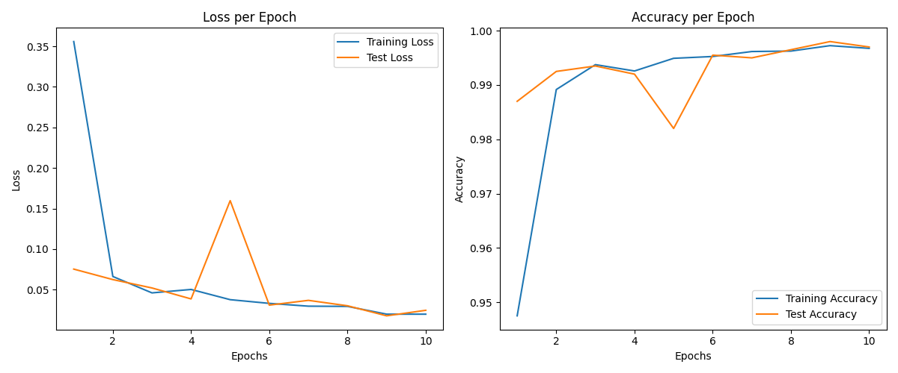

# CNN_FashionMNIST
Atividade pontuada 03 - segundo envio. Disciplina Aprendizado de Máquinas

Modelo foi treinado usando 60.000 imagens do dataset FashionMNIST (10 epochs)

As classes selecionadas foram 0 - T-shirt/top e 5 - Sandal

Também foi utilizado Dropout para evitar sobreajuste.

## gráfico da curva de erro por época para o conjunto de validação e treino.

## acurácia do modelo aplicado às 10 mil imagens da base de teste.
Test Accuracy: 99.65%

## Instruções para o código:
* instalar numpy, matplotlib e scipy;
* executar o arquivo main.py

### Referências:

### 1 - Projeto: zalandoresearch / fashion-mnist <\b>
utilizados:
* pasta data com dataset treino e teste FashionMNIST;
* função load_mnist do arquivo mnist_reader para carregar dados do dataset (Utiliza apenas Python).
* url: https://github.com/zalandoresearch/fashion-mnist

### 2 - Projeto: TheIndependentCode / Neural-Network <\b>
utilizados:
* Algumas classes que modelam as camadas e as funções de ativação foram utilizadas como base* 
(Convolutional, Dense, Reshape, Sigmoid e Softmax). Utilizam apenas numpy (e scipy para correlate2d na camada convolucional);
* Algumas funções como train e predict foram modificadas para funcionar no problema atual.
* url: https://github.com/TheIndependentCode/Neural-Network

Demais classes e funções (Dropout, MaxPooling, categorical_cross_entropy, etc)
foram criadas para solucionar o problema e seguiram a mesma estrutura do projeto 2.

